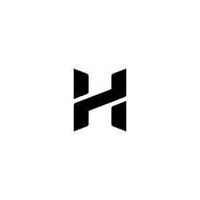

<div align="center">
  
  <h1>Hemkumar N - Portfolio</h1>
  <p><strong>A NeoBrutalist Personal Portfolio Website</strong></p>
  <p>
    <a href="https://hemkumar.dev/">View Live Site</a> •
    <a href="#features">Features</a> •
    <a href="#technologies">Technologies</a> •
    <a href="#getting-started">Getting Started</a>
  </p>
</div>

##  Overview
Welcome to the repository for my personal portfolio website! This project is designed with a striking **NeoBrutalist** aesthetic, featuring high-contrast colors, bold typography, and micro-interactions. It serves as a central hub to showcase my skills as a Full Stack Developer, my latest projects, and professional experience.

##  Features
- **NeoBrutalist UI:** Unique, high-contrast, and bold visual design language.
- **Dynamic Animations:** Floating marquees, glitch effects, and a custom cursor.
- **Live Coding Stats:** Real-time GitHub contribution statistics fetching.
- **Interactive UI:** Interactive project cards and responsive layout.
- **SEO Optimized:** Structured data (JSON-LD), semantic HTML, and proper meta tags.
- **Performance Focused:** No heavy frameworks, purely powered by static HTML, vanilla JavaScript, and utility-based CSS.

##  Technologies Used
- **HTML5:** Semantic architecture.
- **Tailwind CSS:** For rapid and responsive styling.
- **JavaScript (Vanilla):** To handle dynamic stats fetching and UI logic.
- **Remix Icons:** Sleek, modern icon pack.
- **Google Fonts:** `Space Grotesk` and `JetBrains Mono` for a distinctive typography pair.

##  Getting Started

Since this is a static website without a build step, getting it running locally is incredibly simple:

1. **Clone the repository:**
   ```bash
   git clone https://github.com/Hem1234567/Hemkumar-N-Portfolio.git
   ```

2. **Navigate to the directory:**
   ```bash
   cd Hemkumar-N-Portfolio
   ```

3. **Open the site:**
   - You can simply double-click `index.html` to open it in your browser.
   - Or, for a better development experience, use [Live Server](https://marketplace.visualstudio.com/items?itemName=ritwickdey.LiveServer) in VS Code.

##  Contact / Let's Connect!
- **LinkedIn:** [Hemkumar N](https://www.linkedin.com/in/hemkumar-n-1522672a0/)
- **GitHub:** [@Hem1234567](https://github.com/Hem1234567)
- **Portfolio:** [hemkumar.dev](https://hemkumar.dev/)

---
<div align="center">
  <sub>Built with  by Hemkumar N</sub>
</div>